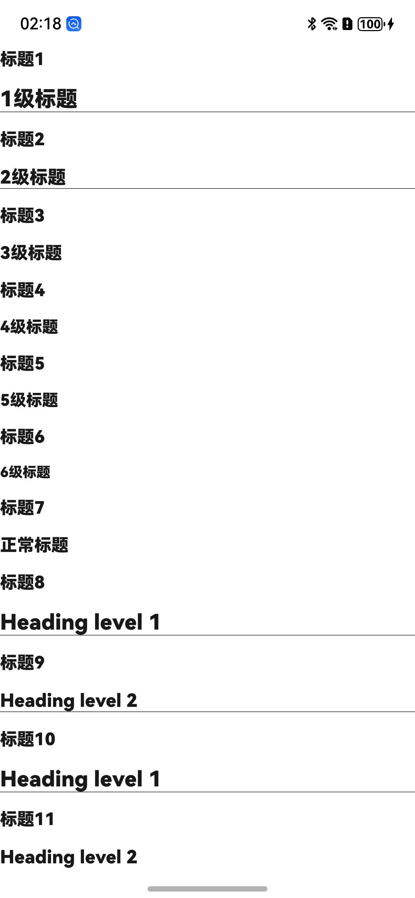

<div align="center">
<h1>Markdown4cj</h1>
</div>

<p align="center">


</p>

## 介绍

Markdown是一种轻量级标记语言，排版语法简洁，让人们更多地关注内容本身而非排版。

Markdown4cj是一个用仓颉语言编写的适用于鸿蒙系统的Markdown库。

## 优势

- 使用高效便捷
- 扩展性强，用户可自定义Markdown显示样式
- 符合 Markdown 规范

### 特性

1. 支持增量加载功能
2. 支持标题语法
3. 支持段落语法
4. 支持分割线语法
5. 支持内联代码语法
6. 支持缩进代码语法
7. 支持围栏代码语法
8. 支持图片语法
9. 支持加粗语法
10. 支持斜体语法
11. 支持删除线语法
12. 支持链接语法
13. 支持部分HTML语法
14. 支持软换行语法和硬换行语法
15. 支持表格语法
16. 支持有序列表语法
17. 支持无序列表语法
18. 支持任务列表语法
19. 支持块引用语法
20. 支持脚注语法
21. 支持数学公式语法
22. 支持自动网址链接语法
23. 支持围栏代码文本高亮
24. 支持代码块行号
25. 支持列表嵌套其他元素
26. 支持文本样式设置
27. 支持表格样式设置
28. 支持代码块文本高亮设置
29. 支持深浅色主题设置
30. 支持链接图片化和样式设置

## 软件架构


### 源码目录

```shell
├─AppScope
├─doc
├─entry
│  └─src
│      └─main
│          ├─cangjie
│          └─resources
├─markdown
│  └─src
│      └─main
│          ├─cangjie
│          │  └─src
│          │      ├─components
│          │      ├─core
│          │      └─plugin
│          └─resources
└─hvigor

```

- `AppScope` 全局资源存放目录和应用全局信息配置目录
- `doc` API文档和使用手册存放目录
- `entry` 工程模块 - 编译生成一个HAP
- `entry src` APP代码目录
- `entry src main` APP项目目录
- `entry src main cangjie` 仓颉代码目录
- `entry src main resources` 资源文件目录
- `markdown` 工程模块 - 编译生成一个har包
- `markdown src` 模块代码目录
- `markdown src main` 模块项目目录
- `markdown src main cangjie` 仓颉代码目录
- `markdown src main resources` 资源文件目录
- `markdown src main cangjie src components` markdown UI页面目录
- `markdown src main cangjie src core` markdown 数据解析处理目录
- `markdown src main cangjie src plugin` markdown 插件化目录
- `hvigor` 构建工具目录

### 接口说明

主要类和函数接口说明详见 [API](doc/API.md)

## 使用说明

### 编译构建

1. 通过module引入
   1. 克隆下载项目
   2. 将markdown模块拷贝到应用项目下
   3. 将markdown模块当module引用，修改项目下的 build-profile.json5 文件，在 modules 字段添加下面代码
      ```json
      {
      "name": "markdown",
      "srcPath": "./markdown"
      }
      ```
   4. 修改自身应用 entry 下的 oh-package.json5 文件，在 dependencies 字段添加 "markdown": "file:../markdown"
      ```json
      {
         "name": "entry",
         "version": "1.0.0",
         "description": "Please describe the basic information.",
         "main": "",
         "author": "",
         "license": "",
        "dependencies": {
            "markdown": "file:../markdown"
        }
      }
      ```
   5. 修改自身应用 entry/src/main/cangjie 下的 cjpm.toml 文件，在 [dependencies] 字段下添加
      ```toml
      [dependencies.markdown]
        path = "../../../../markdown/src/main/cangjie"
      ```
   6. 在项目中使用 import markdown.components.* 引用markdown项目
      ```cangjie
      import markdown.components.*
      ```

### 功能示例

```cangjie
import ohos.base.*
import ohos.component.*
import ohos.state_manage.*
import ohos.state_macro_manage.*
import markdown.components.*

@Entry
@Component
class ARHeading1Page {
    func build() {
        Scroll() {
            Column {
                MarkdownAIComponent(output: mdStr, isFull:true)
            }
        }
        // 设置滚动方法
        .scrollable(ScrollDirection.Vertical)
    }

    let mdStr: String = """
### 标题1

# 1级标题

### 标题2

## 2级标题

### 标题3

### 3级标题

### 标题4

#### 4级标题

### 标题5

##### 5级标题

### 标题6

###### 6级标题

### 标题7

### 正常标题

### 标题8

Heading level 1
===============

### 标题9

Heading level 2
---------------

### 标题10

Heading level 1
=

### 标题11

Heading level 2
-

"""
}
```

### 显示效果



## 约束与限制

当前基于 DevEco Studio for Windows 5.0.9.300 和 DevEco Studio Cangjie Plugin Beta1 for Windows 5.0.9.300 版本实现的

1. 内联代码暂未支持背景色设置
2. 链接和删除线同时存在情况，只支持显示删除线的的中划线，不显示链接的下划线
3. 围栏代码块高亮语言支持如下(语言类型不区分大小写，每行如有多个则表示该语言支持别名书写)：
   1. brainfuck
   2. c
   3. clike
   4. clojure
   5. cpp、c++
   6. csharp、dotnet、c#
   7. css_extras
   8. css
   9. dart
   10. git
   11. go、golang
   12. groovy
   13. java
   14. javascript、js、typescript、ts
   15. json、jsonp
   16. kotlin
   17. latex
   18. makefile
   19. markdown、md
   20. markup、svg
   21. python、python3、py、py3、Python ML、pythonml、pandas、pythondata
   22. scala
   23. sql、mysql、oracle、oraclesql、sqlserver、MS SQL Server、mssql、postgresql、pgsql
   24. swift
   25. yaml
   26. cangjie、cj
   27. rust
4. 表格限制：
   1. 不支持行内添加标题
   2. 不支持行内添加块引用
   3. 不支持行内添加有序、无序、任务列表
   4. 不支持行内添加图片
   5. 不支持行内添加缩进代码块、围栏代码块
5. 图文混排支持本地图片和网络图片的图文混排
   1. 不支持沙盒路径下的本地图片
   2. 不支持rawfile目录下本地图片
   3. 不支持带style标签的图片
6. 暂未支持稀疏排列和紧密排列
7. 数学公式背景色暂不支持设置透明色
8. HTML支持的标签
   1. 块元素
      1. hr标签 - 分割线
      2. h1~h6标签 - 标题
      3. blockquote标签 - 块引用
      4. ul、ol、li标签 - 有序列表和无序列表
      5. table、thead、tbody、tfoot、tr、th、td标签 - 表格
      6. pre标签 - 缩进代码块
      7. p标签 - 段落标签
   2. 行内元素
      1. font标签 - 文本样式
         * color属性
         * size属性
      2. a标签 - 链接
         * href属性 - 必选属性
         * title属性
      3. b、strong标签 - 加粗
      4. i、em、cite、dfn标签 - 斜体
      5. s、del标签 - 删除
      6. code、samp、var、kbd标签 - 内联代码
   3. 行内块元素
      1. br标签 -  换行符
      2. img标签 - 图片
         * src属性 - 必选属性
         * title属性
         * width属性
         * height属性

## 开源协议

本项目基于 [Apache License 2.0](./LICENSE) ，请自由的享受和参与开源。

## 参与贡献

欢迎给我们提交PR，欢迎给我们提交Issue，欢迎参与任何形式的贡献。
