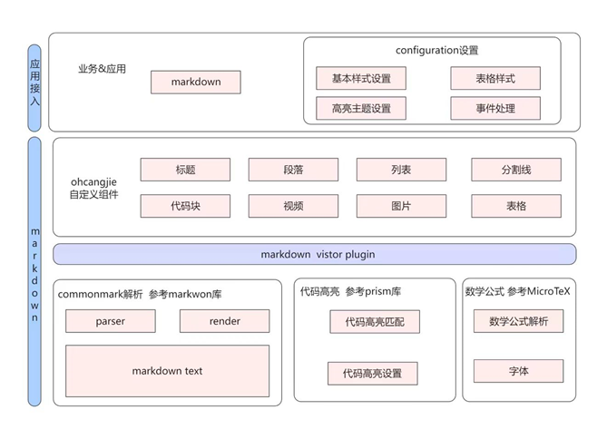
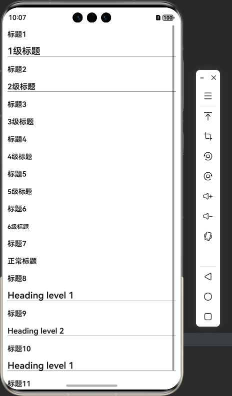

<div align="center">
<h1>Markdown4cj</h1>
</div>

<p align="center">


</p>

## 介绍

Markdown是一种轻量级标记语言，排版语法简洁，让人们更多地关注内容本身而非排版。

Markdown4cj是一个用仓颉语言编写的适用于鸿蒙系统的Markdown库。

## 优势

- 使用高效便捷
- 扩展性强，用户可自定义Markdown显示样式
- 符合 Markdown 规范

### 特性

1. 支持标题语法展示
2. 支持段落语法展示
3. 支持分割线语法展示
4. 支持内联代码语法显示
5. 支持缩进代码块显示
6. 支持围栏代码块显示
7. 支持图片语法显示
8. 支持加粗语法
9. 支持斜体语法
10. 支持删除线语法
11. 支持链接语法
12. 支持围栏代码语法高亮显示
13. 支持内联html\<br>语法显示
14. 支持软换行和硬换行语法显示
15. 支持表格语法显示
16. 支持有序列表语法显示
17. 支持无序列表显示
18. 支持任务列表显示
19. 支持块引用语法显示
20. 支持列表中嵌套其他元素显示
21. 支持Toc目录显示扩展功能
22. 支持视频播放扩展功能
23. 支持图片幻灯片扩展功能
24. 支持组合代码模式扩展功能
25. 支持数学公式展示的功能扩展
26. 支持markdown文本样式设置功能
27. 支持表格样式设置功能
28. 支持代码语法高亮样式设置功能

## 软件架构



### 源码目录

```shell
├─AppScope
├─doc
├─entry
│  └─src
│      └─main
│          ├─cangjie
│          └─resources
├─markdown
│  └─src
│      └─main
│          ├─cangjie
│          │  └─src
│          │      ├─components
│          │      ├─core
│          │      └─plugin
│          └─resources
└─hvigor

```

- `AppScope` 全局资源存放目录和应用全局信息配置目录
- `doc` API文档和使用手册存放目录
- `entry` 工程模块 - 编译生成一个HAP
- `entry src` APP代码目录
- `entry src main` APP项目目录
- `entry src main cangjie` 仓颉代码目录
- `entry src main resources` 资源文件目录
- `markdown` 工程模块 - 编译生成一个har包
- `markdown src` 模块代码目录
- `markdown src main` 模块项目目录
- `markdown src main cangjie` 仓颉代码目录
- `markdown src main resources` 资源文件目录
- `markdown src main cangjie src components` markdown UI页面目录
- `markdown src main cangjie src core` markdown 数据解析处理目录
- `markdown src main cangjie src plugin` markdown 插件化目录
- `hvigor` 构建工具目录

### 接口说明

主要类和函数接口说明详见 [API](doc/API.md)

## 使用说明

### 编译构建

1. 通过module引入
   1. 克隆下载项目
   2. 将markdown模块拷贝到应用项目下
   3. 修改自身应用 entry 下的 oh-package.json5 文件，在 dependencies 字段添加 "markdown": "file:../markdown"
      ```json
      {
         "name": "entry",
         "version": "1.0.0",
         "description": "Please describe the basic information.",
         "main": "",
         "author": "",
         "license": "",
        "dependencies": {
            "markdown": "file:../markdown"
        }
      }
      ```
   4. 修改自身应用 entry/src/main/cangjie 下的 cjpm.toml 文件，在 [dependencies] 字段下添加
      ```toml
      [dependencies.markdown]
         path = "../../../../markdown/src/main/cangjie"
      ```
   5. 在项目中使用 import markdown.components.* 引用markdown项目
      ```cangjie
      import markdown.components.*
      ```

### 功能示例

```cangjie
/*
 * Copyright (c) Huawei Technologies Co., Ltd. 2024-2024. All rights resvered.
 */
package ohos_app_cangjie_entry

import ohos.base.*
import ohos.component.*
import ohos.state_manage.*
import ohos.state_macro_manage.*
import markdown.components.*

@Entry
@Component
class Index {
    func build() {
        Scroll() {
            Column {
                MarkdownComponent(mdStr: mdStr)
            }
        }
        // 设置滚动方法
        .scrollable(ScrollDirection.Vertical)
    }

    let mdStr: String = """
### 标题1

# 1级标题

### 标题2

## 2级标题

### 标题3

### 3级标题

### 标题4

#### 4级标题

### 标题5

##### 5级标题

### 标题6

###### 6级标题

### 标题7

### 正常标题

### 标题8

Heading level 1
===============

### 标题9

Heading level 2
---------------

### 标题10

Heading level 1
=

### 标题11

Heading level 2
-

"""
}
```

### 显示效果



## 约束与限制

在下述版本验证通过:

| 编号 | 依赖构建工具                                       | 版本号            |
|----|----------------------------------------------|----------------|
| 1  | **DevEco Studio 6.0.2 Release**              | 6.0.2.640      |
| 2  | **cjc**                                      | v1.1.0-beta.10 |
| 3  | **DevEco Studio-Cangjie Plugin 6.0.2 Beta2** | 6.0.2.640      |

markdown依赖三方库：

| 编号 | 依赖三方库         | 版本号              |
|----|---------------|------------------|
| 1  | stdx          | v1.1.0-beta.10.1 |
| 2  | commonmark4cj | v1.0.3           |
| 3  | prism4cj      | v1.0.4           |
| 4  | formula       | v1.5.0           |

1. 内联代码暂未支持背景色设置
2. 链接和删除线同时存在情况，只支持显示删除线的的中划线，不显示链接的下划线
3. 围栏代码块高亮语言支持如下(语言类型不区分大小写，每行如有多个则表示该语言支持别名书写)：
   1. brainfuck
   2. c
   3. clike
   4. clojure
   5. cpp、c++
   6. csharp、dotnet、c#
   7. css_extras
   8. css
   9. dart
   10. git
   11. go、golang
   12. groovy
   13. java
   14. javascript、js、typescript、ts
   15. json、jsonp
   16. kotlin
   17. latex
   18. makefile
   19. markdown、md
   20. markup、svg
   21. python、python3、py、py3、Python ML、pythonml、pandas、pythondata
   22. scala
   23. sql、mysql、oracle、oraclesql、sqlserver、MS SQL Server、mssql、postgresql、pgsql
   24. swift
   25. yaml
   26. cangjie、cj
   27. rust
4. 视频只支持特定的视频格式
5. 表格限制：
   1. 不支持行内添加标题
   2. 不支持行内添加块引用
   3. 不支持行内添加有序、无序、任务列表
   4. 不支持行内添加图片
   5. 不支持行内添加视频
   6. 不支持行内添加图片banner
   7. 不支持行内添加缩进代码块、围栏代码块、围栏代码组合列表块
6. 列表最多支持嵌套12层
7. 图文混排支持本地图片和网络图片的图文混排
   1. 本地图片路径格式需要按照应用沙箱目录 https://gitcode.com/openharmony/docs/blob/master/zh-cn/application-dev/file-management/app-sandbox-directory.md 处理
   2. 支持rawfile目录下本地图片，相对路径是基于rawfile的路径
   3. 不支持带style标签的本地图片
   4. 支持的图片格式包括: png、jpg、bmp、svg和gif
8. TOC插件应在最后加载, 避免受其他插件影响

## 开源协议

本项目基于 [Apache License 2.0](./LICENSE) ，请自由的享受和参与开源。

## 参与贡献

欢迎给我们提交PR，欢迎给我们提交Issue，欢迎参与任何形式的贡献。
