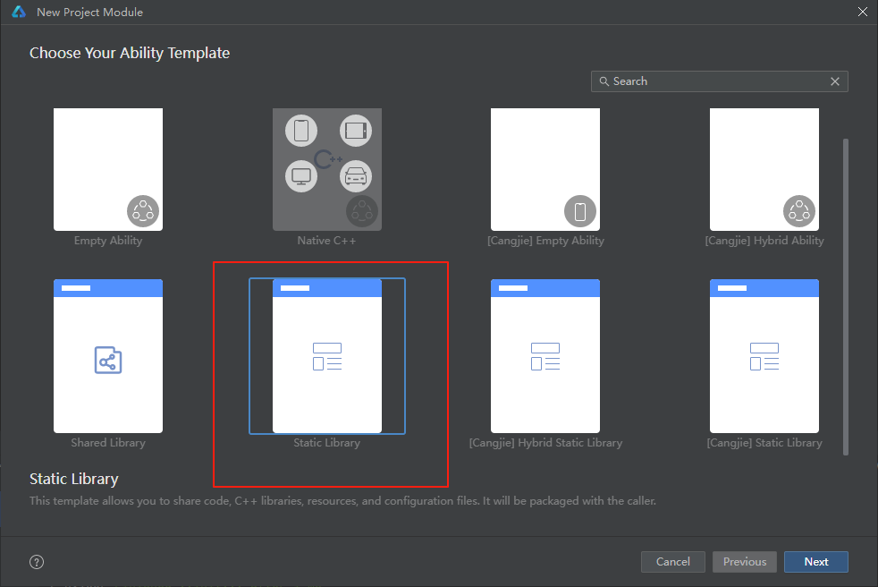
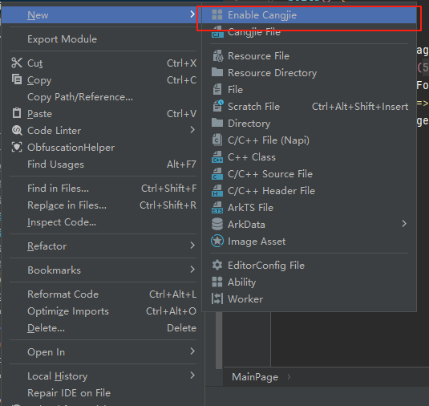
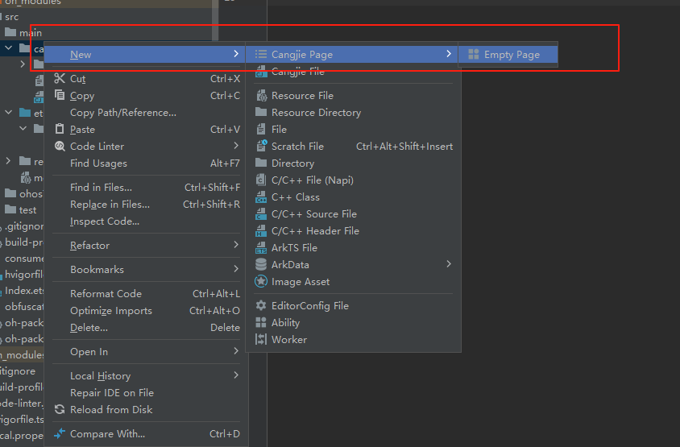

# markdown互操作封装

## 项目创建

1. 新建ArkUI项目

2. 在项目中新建ArkUI模块

   

3. 在模块中添加仓颉互操作库

   

## 编写互操作代码

1. 非UI接口

   互操作参考文档 https://developer.huawei.com/consumer/cn/doc/cangjie-references-V5/cj-ark-interop-apis-V5

   ArkTS调用仓颉 https://developer.huawei.com/consumer/cn/doc/cangjie-guides-V5/method_of_arkts_calling_cangjie-V5

2. UI页面
   
   混合开发 https://developer.huawei.com/consumer/cn/doc/cangjie-references-V5/cj_appendix-hybrid-v2-V5

   创建仓颉UI 
   
## 接口对应关系

| UI参数   | 互操作接口参数   | ArkUI入参 |
|--------|-----------|---------|
| Color  | UInt32    | number  |
| String | String    | string  |
| Bool   | Bool      | boolean |
| Array  | JSArrayEx | Array   |